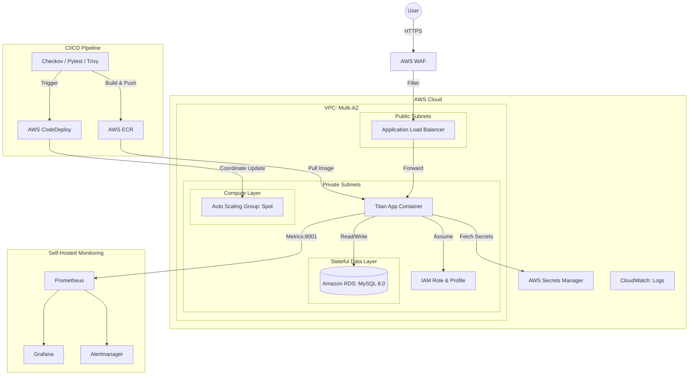

# Project Titan: Enterprise-Ready AWS Cloud Native Platform

[](https://github.com/your-username/aws_devops/actions)
[](https://www.terraform.io/)
[](https://www.checkov.io/)
[](https://aws.amazon.com/)

This repository demonstrates an **Advanced DevOps architecture** tailored for high-availability, zero-trust security, and automated deployments on AWS. It showcases skills expected from a Senior DevOps Engineer.

## 🏗️ Architecture Overview



### 1. Advanced Infrastructure & Stateful Data
*   **Modular Terraform**: Separated into `vpc`, `compute`, `security`, `rds`, `waf`, and `codedeploy` modules for scalability and easy maintenance.
*   **Stateful Data Layer**: Includes an AWS RDS (MySQL) module provisioned in private subnets, demonstrating the ability to handle stateful workloads securely.
*   **Dynamic Secrets**: Database passwords are auto-generated via Terraform `random_password` and stored directly into **AWS Secrets Manager**. Applications fetch credentials at runtime.
*   **Cost Optimization**: Utilizes **AWS Spot Instances** in the Auto Scaling Group, yielding massive cost savings while preserving HA through Multi-AZ design.

### 2. Edge Security & Zero-Trust (WAF)
*   **Edge Protection**: **AWS WAF** is attached to the Application Load Balancer to intercept malicious traffic (e.g., SQL Injection, XSS) before it reaches the compute layer.
*   **Strict Security Groups**: The RDS database is fully isolated and only accepts traffic exclusively from the Application Security Group on port 3306.

### 3. Modern Deployment Strategy (ECR & CodeDeploy)
*   **Container Workflow**: Applications are containerized via Docker and pushed to **AWS ECR**.
*   **Automated Rollouts**: Uses **AWS CodeDeploy** for synchronized updates across EC2 nodes in the Auto Scaling Group, minimizing manual intervention and enabling robust deployment strategies (like Blue/Green or Rolling updates).

### 4. DevSecOps "Shift-Left" Pipeline
*   **IaC Security**: PRs are scanned by **Checkov** to prevent misconfigurations (e.g., overly permissive SGs).
*   **Container Supply Chain**: **Trivy** scans block deployments if Critical CVEs are found in the Docker image.

### 5. High-Fidelity Observability
*   **Dashboards-as-Code**: Grafana and Prometheus are fully provisioned via Docker Compose with auto-loaded JSON dashboards.
*   **Actionable Alerting**: Implemented `Alertmanager` for SLI thresholds (e.g., High Latency, Instance Down).

## 🚀 Getting Started

### 1. Infrastructure Deployment
```bash
cd terraform
terraform init
terraform plan
terraform apply -var-file="prod.tfvars"
```

### 2. Application Deployment (CI/CD)
Pushing to the `main` branch will automatically:
1. Run Checkov & Trivy security scans.
2. Build and push the Docker image to AWS ECR.
3. Trigger AWS CodeDeploy to pull the new image and restart the application nodes.

> Naming source of truth: `PROJECT_NAME` is defined in `.github/workflows/deploy.yml` and passed into Terraform (`-var "project_name=..."`) and CodeDeploy naming to keep all deployed resources consistent.

### 3. Local Monitoring Stack
```bash
cd monitoring
docker-compose up -d
```
*   **Grafana**: `http://localhost:3000` (admin/admin)
*   **Prometheus**: `http://localhost:9090`

## 📊 Interview Talking Points
*   *"To protect the application edge, I implemented AWS WAF on the ALB to mitigate OWASP Top 10 vulnerabilities like SQL injection before traffic even hits our VPC."*
*   *"Instead of hardcoding credentials, I integrated AWS Secrets Manager. Terraform automatically generates a strong random database password, stores it in Secrets Manager, and the application dynamically retrieves it via boto3."*
*   *"For deployments, I transitioned the architecture from static user-data scripts to a modern CI/CD flow utilizing AWS ECR as the immutable registry and AWS CodeDeploy to orchestrate container rollouts across our Spot Instance ASG fleet."*
