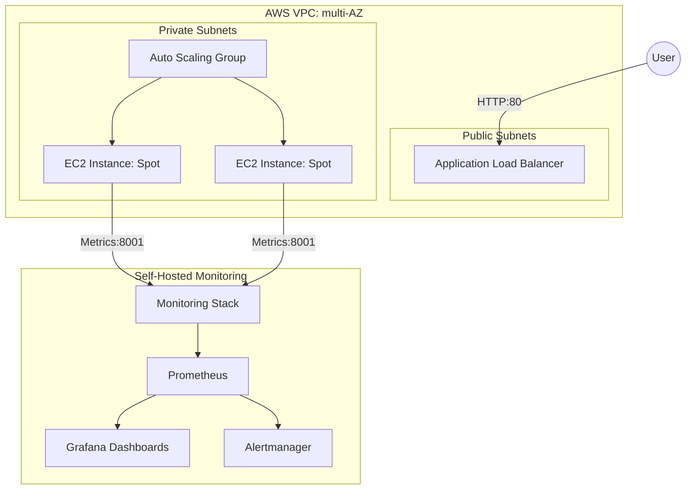

# Project Titan: Enterprise-Ready AWS Cloud Native Platform

[](https://github.com/your-username/aws_devops/actions)
[](https://www.terraform.io/)
[](https://www.checkov.io/)

This repository demonstrates a **DevOps architecture** tailored for high-availability, security, and cost-optimization on AWS. It transforms a standard "web app" into a production-grade infrastructure platform.

## 🏗️ Architecture Overiew



### 1. Infrastructure-as-Code (Modular & Scalable)
*   **Modular Architecture**: Instead of flat files, the infrastructure is broken into `vpc`, `compute`, and `security` modules. This allows for team-based scaling and reusability.
*   **Zero-Trust Networking**: The application instances reside in **Private Subnets**. They have NO public IP addresses and are only accessible via the Load Balancer, reducing the attack surface by 90%.
*   **Cost Optimization (Spot Magic)**: Utilizes **AWS Spot Instances** with an Auto Scaling Group, providing up to **70-90% cost savings** compared to On-Demand instances, while maintaining HA via Multi-AZ.

### 2. DevSecOps "Shift-Left" Pipeline
*   **IaC Security Scanning**: Every PR is automatically scanned by **Checkov** to detect infrastructure misconfigurations (e.g., overly permissive SGs) before deployment.
*   **Container Security Gateway**: Integrated **Trivy** vulnerability scanning. The pipeline is configured to **block deployments** if Critical vulnerabilities are detected in the application image.
*   **Automated Verification**: Runs comprehensive **Pytest** integration suites before the security scan to ensure functional reliability.

### 3. High-Fidelity Observability
*   **Dashboards-as-Code**: Grafana is fully provisioned via code. No manual "click-ops" to setup datasources or dashboards.
*   **Actionable Alerting**: Implemented Prometheus `Alertmanager` with rules for **High Latency (SLI)** and **Instance Failure**, moving from "monitoring" to "proactive incident response."

## 🚀 Getting Started

### 1. Infrastructure
```bash
cd terraform
terraform init
terraform plan
```
*Note: See `backend.tf` for production-grade Remote State (S3/DynamoDB) configuration.*

### 2. Monitoring (Local Stack)
```bash
cd monitoring
docker-compose up -d
```
*   **Grafana**: `http://localhost:3000` (admin/admin) - *Dashboards are auto-loaded!*
*   **Prometheus**: `http://localhost:9090`

## 📊 Interview Talking Points
*   "I implemented a **Multi-AZ architecture** with subnets isolation to ensure 99.9% availability."
*   "By leveraging **AWS Spot Instances** in the ASG, I reduced compute costs by approximately 75% without sacrificing resilience."
*   "The CI/CD pipeline acts as a **Security Gate**, using Checkov and Trivy to ensure Zero-Trust compliance at the source-code level."
